# Teach To Me

[Enlace Burndown Chart](https://docs.google.com/spreadsheets/d/1e1N1zd1U_OG5T2ELwBz_HQ3leefo6FXZyYKzylzRoOI/edit#gid=0)

[Enlace Taiga](https://tree.taiga.io/project/nicolasaguilera9906-eduapp/backlog)

[Manual de Uso](https://daniwalteros596.gitbook.io/teach-to-me/)

## Asignatura 

Arquitecturas de software (ARSW) 2020-2 

## Descripción

Teach To Me es una App educativa para estudiantes y profesores. Nuestro país cuenta con mas del 72% de cobertura en educación media. Sin embargo, en cuanto a resultados se refiere , somos uno de los peores países ubicados en las pruebas PISA y estamos debajo del promedio de la OCDE. Es por esto, que es necesario mejorar la calidad de la educación que es ofrecida actualmente. Es por esto que la aplicación está destinada a apoyar el proceso educativo de niños y jóvenes que sientan falencias en su proceso educativo. La aplicación permitirá el registro de profesores que estén dispuestos a enseñar un tema que deseen. Deberán registrarse con los conocimientos que posean (títulos , posgrados , etc). Posteriormente podrán elegir un intervalo de horas por día en el que estén dispuestos a enseñar un tema en específico (ejemplo: hoy de 2 a 4 estaré online para resolver dudas sobre física). Por su parte, los estudiantes podrán entrar a la plataforma y ver qué clases se encuentran disponibles en el momento. Una vez escogida la clase, podrán conectarse en una sesión virtual con el profesor donde tendrán un tablero interactivo, webcam y chat común.

## Logo

## Wireframes

Sign-up del usuario.

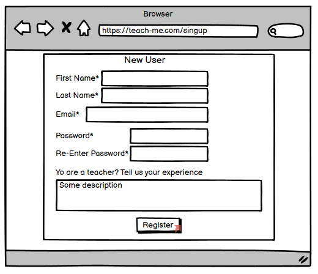

Login del usuario.

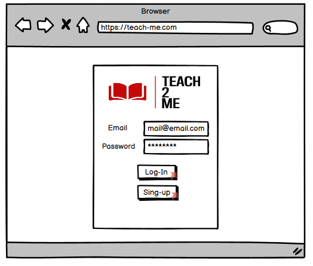

Apenas un usuario ingresa la siguiente vista es mostrada.

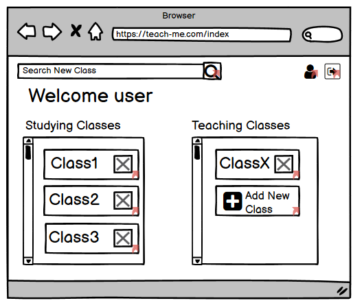

Al buscar una clase los resutados son mostrados según la siguiente vista.

Al seleccionar una de las clases se podrá ver la informacion correspondiente e inscribirme o conectarme a la clase en cuestion.

Desde el index se podrán visualizar mis clases inscritas y conectarme de la misma manera.

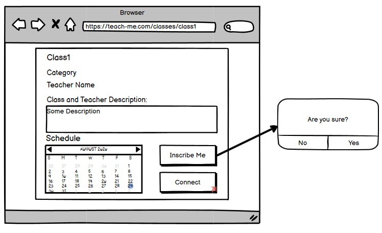

La siguiente vista representa la clase en cuestion.

Tambien podré crear una clase donde la siguiente vista es mostrada.

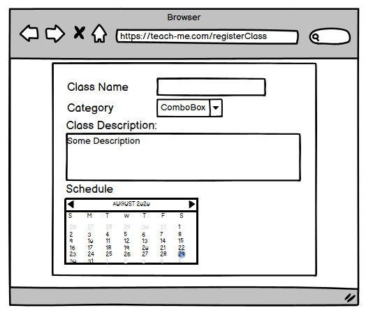

Una vez la clase es creada, esta se visualizará en el index. Al darle click la siguiete vista es mostrada, aqui se puede eliminar la clase, aceptar a los estudiantes y comenzar la sesión.

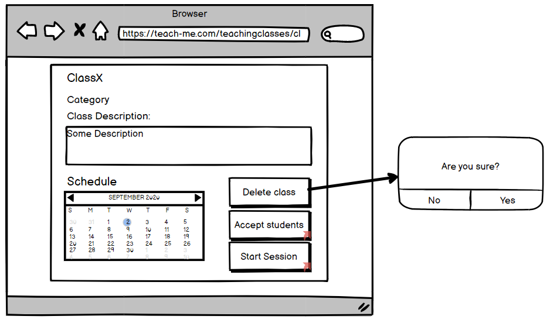

En la siguiente vista se aceptaran los estudiantes.

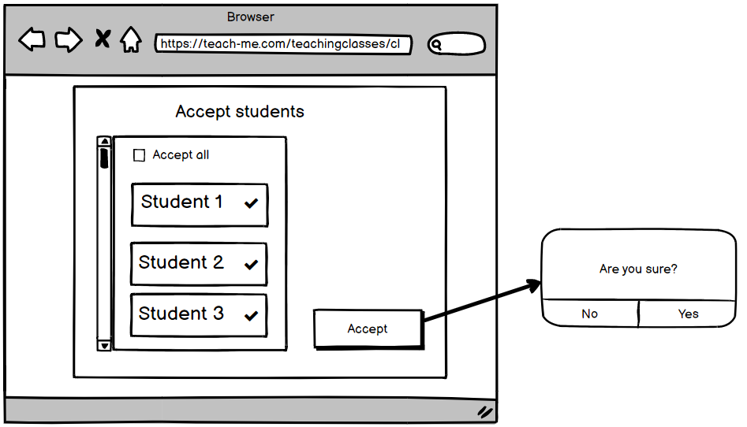

Por ultimo, la siguiente vista representa el perfil de un usuario.

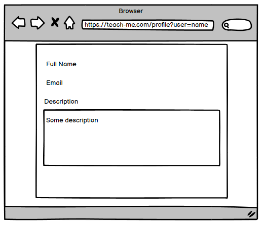

## Casos de uso

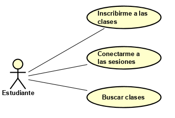

* Como estudiante quiero inscribirme a las clases para poder aprender los temas en los que tengo dudas.
* Como estudiante quiero conectarme a las sesiones  para poder asistir a las clases en las que solicité unirme
* Como estudiante quiero buscar clases para poder encontrar el tema en el que tengo dudas.

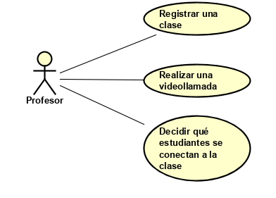

* Como profesor quiero registrar una clase para poder ofrecerla a los estudiante 
* Como profesor quiero realizar una videollamada para poder interactuar con mis estudiantes durante la videollamada
* Como profesor quiero decidir qué estudiantes se conectan a la clase para poder saber las personas que estarán en la sesión

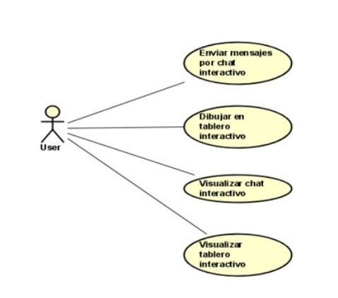

* Como Usuario quiero enviar mensajes por chat interativo para poder comunicarme con los otros usuarios
* Como Usuario quiero visualizar chat interativo para poder ver lo que comentan otros usuarios
* Como Usuario quiero dibujar en el tablero interactivo para poder interactuar con los otros usuarios
* Como Usuario quiero visualizar el tablero interactivo para poder ver lo que dibujan otros usuarios

## Diagrama de clases

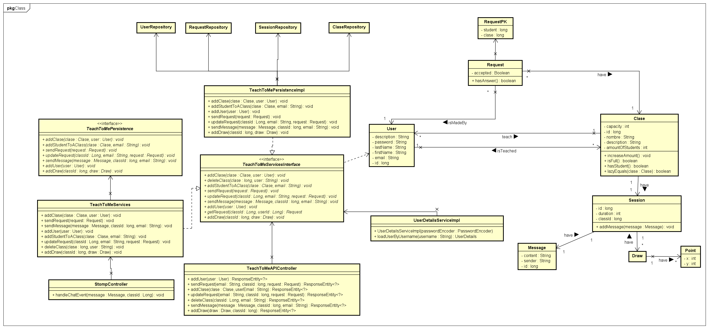

## Diagrama de paquetes

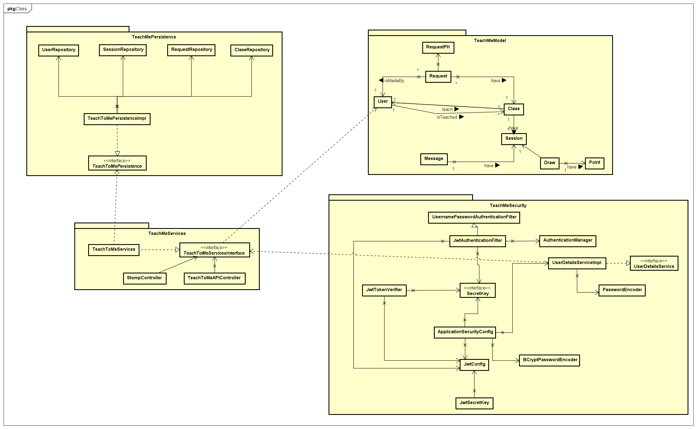

## Diagrama entidad relacion

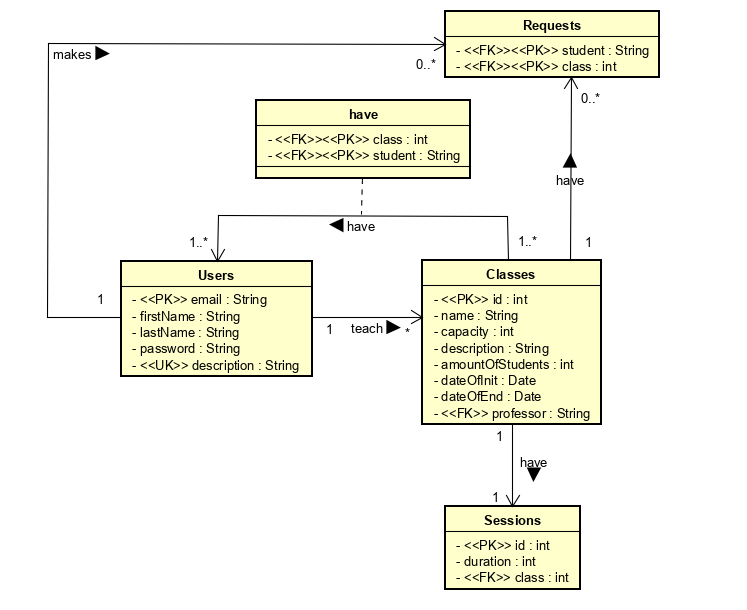

## Diagrama de componentes

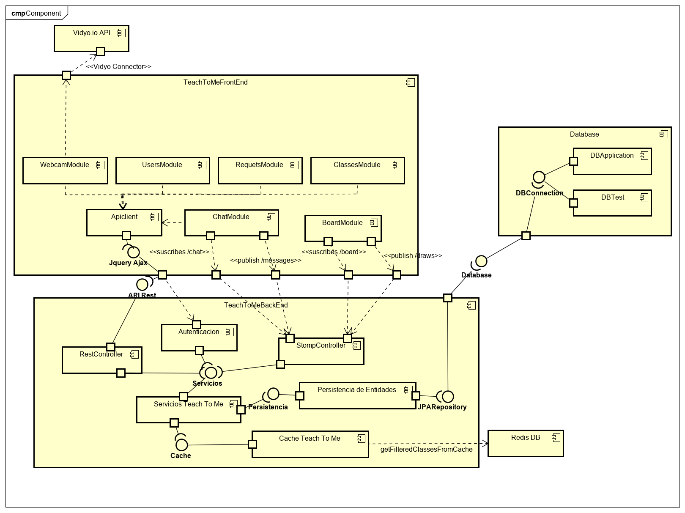

## Diagrama de despliegue

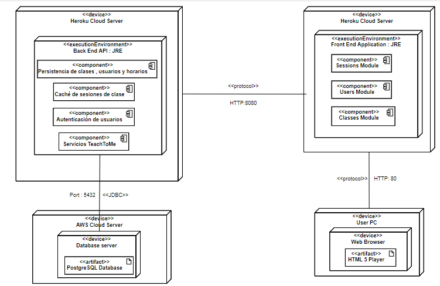

## Autores

* **Nicolas Aguilera Contreras** - Escuela Colombiana de Ingeniería Julio Garavito
* **Juan Camilo Angel Hernandez**  - Escuela Colombiana de Ingeniería Julio Garavito
* **Daniel Felipe Walteros Trujillo**  - Escuela Colombiana de Ingeniería Julio Garavito

## Licencia

This project is under GNU General Public License - see the [LICENSE](LICENSE) file for details.
