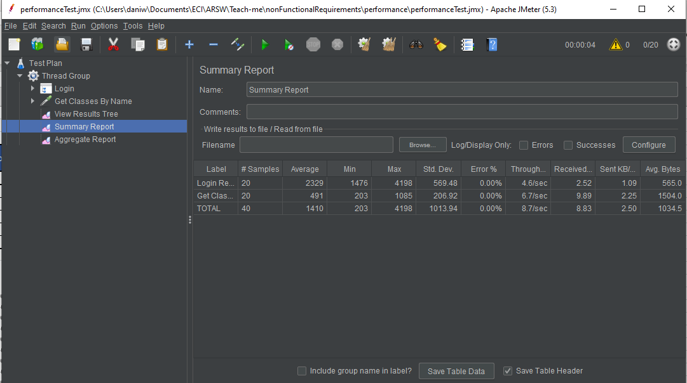
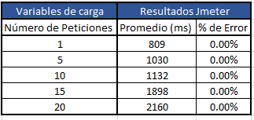
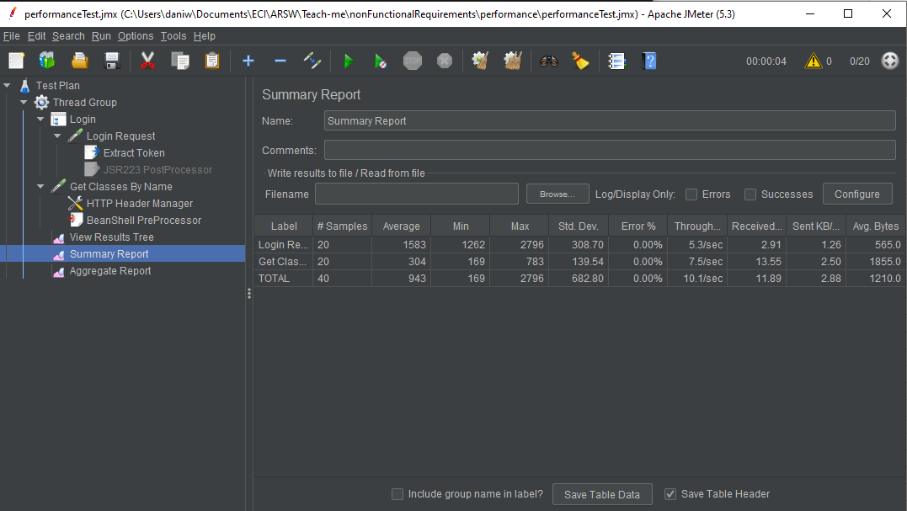
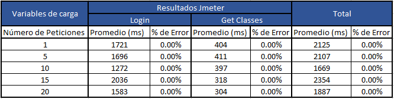
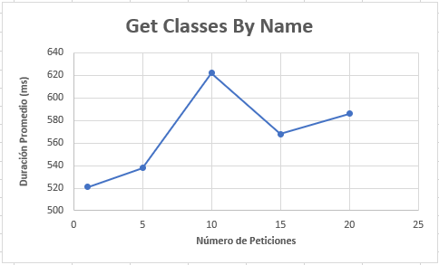

# Rendimiento
## Primer escenario

### Herramienta utilizada para la demostración

#### Jmeter

JMeter es un proyecto de Apache que puede ser utilizado como una herramienta de prueba de carga para analizar y medir el rendimiento de una variedad de servicios, con énfasis en aplicaciones web.

### Caso

Para analizar el escenario se utilizó una petición GET a la url `https://teach2-me.herokuapp.com/api/v1/classes?name=CLASE`

[Ejemplo de resultado](response.json)						

### Antes de implementar el caché

El resultado con 20 peticiones simultaneas fue de 2.16 segundos, a continuación se presenta el ejemplo de la petición con JMeter.

Analizando varias cantidades de peticiones se concluyó que el tiempo promedio de resultados es mayor a un segundo.

Además, al incrementar la cantidad de peticiones, se distingue que se incrementa el tiempo de respuesta, esto implica que para grandes cantidades de solicitudes concurrentes, como las que debe manejar una aplicación web como esta, se debe implementar un sistema de caché para asegurar el rendimiento efectivo de las consultas de clases.

### Después de implementar el caché

Después de haber implementado un caché Redis, el resultado con 20 peticiones simultaneas fue de 0.586 segundos, a continuación se presenta el ejemplo de la petición con JMeter.

Analizando varias cantidades de peticiones se concluyó que el tiempo promedio de resultados es menor a un segundo.

Y al incrementar la cantidad de peticiones se observa un comportamiento mas constante, esto nos permite demostrar que el rendimiento de la aplicación se incrementó para la consulta de clases.

### Conclusión

El uso de un caché Redis nos permitió cumplir el escenario planteado, obtiendo respuestas de gran tamaño en menos de un segundo, además nos permite tener centralizada esta clase información optimizando su acceso de lectura en casi de tener que realizar escalabilidad horizontal en el futuro. 
